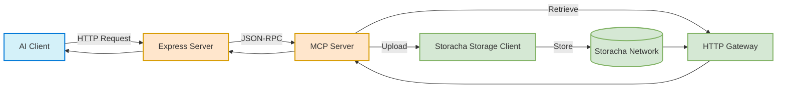
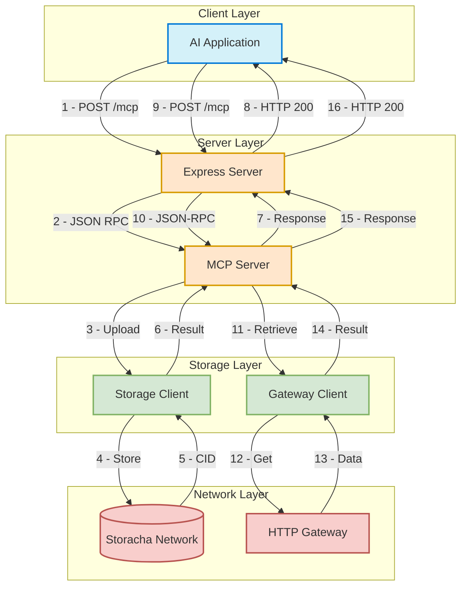

# MCP Server Implementation Details for Storacha Storage

## Overview

This document provides some implementation details for a Model Context Protocol (MCP) server for Storacha storage. The server enables secure file uploads to Storacha's decentralized storage network and file retrievals through Storacha's HTTP gateway.

## Core Concepts

### Purpose

The Storacha MCP server provides standardized access to Storacha's decentralized storage network via the Model Context Protocol. It acts as a bridge between AI applications and decentralized storage, enabling:

- **Decentralized File Storage**: Store files on the Storacha network with content addressing
- **Standardized Access**: Use the MCP standard for tool discovery and invocation
- **Simple Integration**: Integrate with various AI systems and applications

### Transport Options

The Model Context Protocol (MCP) is transport-agnostic, meaning it can operate over different communication channels. For the Storacha MCP server, we've chosen HTTP transport using Express for several reasons:

- File uploads and retrievals are typically one-time operations, not requiring persistent connections
- HTTP is widely supported across all platforms
- RESTful endpoints are easy to secure, route, and scale
- The implementation is simpler and easier to maintain

The implementation uses Express to handle the HTTP layer while delegating the MCP-specific logic to the `McpServer` class from the MCP TypeScript SDK.

### Architecture



## Core Components

**MCP Server**: The core server implementing the MCP specification
   - Uses `@modelcontextprotocol/sdk/server/mcp.js` for handling MCP requests
   - Processes JSON-RPC messages and manages tool registration
   - Does not handle networking directly

**Express Application**: HTTP server that exposes MCP endpoints
   - Handles HTTP routing, CORS, and request/response management
   - Routes requests to the MCP server for processing
   - Manages server configuration and middleware

**Storage Client**: A wrapper around Storacha's w3up client
   - Handles file uploads to the Storacha network
   - Processes space delegation and authentication

**Gateway Client**: Interface to retrieve files via Storacha's HTTP gateway
   - Retrieves files by CID

## Basic Flow

The following diagram illustrates the flow of requests through the Storacha MCP server.



### Flow Description

**Client Layer**
   - AI Application sends HTTP POST requests to `/mcp` endpoint
   - Requests include JSON-RPC messages for upload or retrieve operations

**Server Layer**
   - Express server handles HTTP routing and request parsing
   - MCP server processes JSON-RPC messages and manages tool execution

**Storage Layer**
   - Storage Client manages file uploads to Storacha Network
   - Gateway Client handles file retrievals from HTTP Gateway

**Network Layer**
   - Storacha Network stores uploaded files
   - HTTP Gateway provides access to stored files

## Project Structure

```
/
├── package.json            # NPM package configuration
├── tsconfig.json           # TypeScript configuration
├── .env                    # Environment variables (gitignored)
├── src/
│   ├── server.ts           # Main server entry point
│   ├── config.ts           # Server configuration
│   ├── storage-client.ts   # Storacha storage client wrapper
│   ├── tools/
│   │   ├── index.ts        # Tool registration
│   │   ├── upload.ts       # Upload tool implementation
│   │   └── retrieve.ts     # Retrieve tool implementation
│   └── utils/
│       ├── content-types.ts # Content type helpers
│       ├── validation.ts    # Input validation helpers
│       └── error-handling.ts # Error handling utilities
└── dist/                   # Compiled JavaScript (gitignored)
```

## Performance Considerations

### Handling Larger File Uploads

For large file uploads, consider the following:

**Increased body limit**
```typescript
app.use(express.json({ limit: '100mb' }))
```
sets a 100MB limit.

**Higher Timeouts**

```typescript
// Create HTTP server with longer timeout
const server = app.listen(config.PORT, config.HOST, () => {
  console.log(`Storacha MCP server running on ${config.HOST}:${config.PORT}`);
});
server.timeout = 300000; // 5 minutes
```
configures longer timeout for the server.


**Memory management**

For very large files, we will probably need implementing chunked uploads.

## Security Considerations

**Authentication**

Use the `SHARED_ACCESS_TOKEN` for controlling access to upload operations.

**CORS Policy**

```typescript
app.use((req, res, next) => {
  res.header('Access-Control-Allow-Origin', 'https://yourtrustedapp.com');
  // Rest of CORS configuration
  next();
});
```
Restricts the CORS policy to a known domain.

**Input Validation**

Use Zod schemas to validate all inputs.

**Rate Limiting**

```typescript
import rateLimit from 'express-rate-limit';

const limiter = rateLimit({
  windowMs: 15 * 60 * 1000, // 15 minutes
  max: 100, // limit each IP to 100 requests per windowMs
  message: 'Too many requests from this IP, please try again later'
});

app.use('/mcp', limiter);
```

Using rate limiting for production environments if needed.